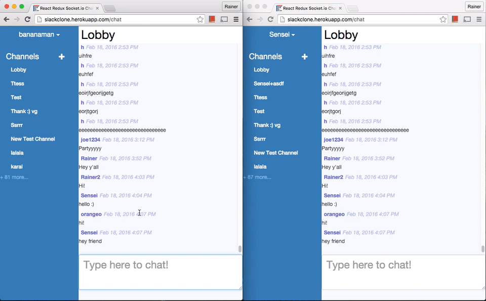

chaoticbot2 is a derivative of chaoticbots project

This project demonstrates the use of watson conversation in conjunction with the google api for book search

The nodejs program works in concert with watson The overall flow, as outlined in watsonrouter.js shows a high degree
of preprocessing of a text message as well as very deep coupling with the watson platform -- specifically coordinating on the
us context flags to signal stage of preprocessing


# React-redux-socketio-chat


Hosted live on bluemix

## Use Guide

You can create channels with the + sign on the nav bar on the left.
If you click on a user's name to send him a private message (opens a private channel)

mediated by watson -- who curates and answers questions before opening to human agents

### MongoDB

Runs off mongolab

### Development

```
npm run dev
```
And then point your browser to `localhost:3000`

Note:
This program comes with [redux-dev tools](https://github.com/gaearon/redux-devtools)
* To hide the dev tool panel press ctrl+h
* To change position press ctrl+m

### Production

```
npm run build
npm start
```
And then point your browser to `localhost:3000`

## Helpful Resources and Inspiring Projects

## Todos
